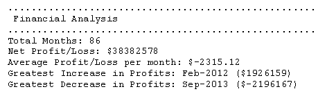
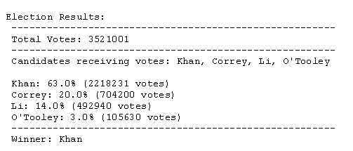

# Basic Python Analysis of Excel/CSV worksheets

This repository contains py files that analyze two different csv worksheets:

## CONTENTS (for each analysis)
This final products for each analysis are:
1. raw data (csv file)
2. python script file
3. txt file with analysis results (generated when the corresponding py file is run)

## 1) Financial Analysis (PyBank):
The accompanying csv mirrors a company's financial records, stored in a very basic csv worksheet (the dataset is composed of two columns: `Date` and `Profit/Losses`).

The python script analyzes the worksheet to calculate the following:
  * The total number of months included in the dataset
  * The net total amount of "Profit/Losses" over the entire period
  * The average of the changes in "Profit/Losses" over the entire period
  * The greatest increase in profits (date and amount) over the entire period
  * The greatest decrease in losses (date and amount) over the entire period

## 2) Election Results Analysis (PyElection):
The accompanying csv mirrors polling results from a local election in a small town. The dataset is composed of three columns: `Voter ID`, `County`, and `Candidate`. 

The python script analyzes the votes and calculates each of the following:
  * The total number of votes cast
  * A complete list of candidates who received votes
  * The percentage of votes each candidate won
  * The total number of votes each candidate won
  * The winner of the election based on popular vote.

## 3) Results:
  For both analyses, the final code prints the analysis to the terminal and exports a text file with the results.
  

  
  
